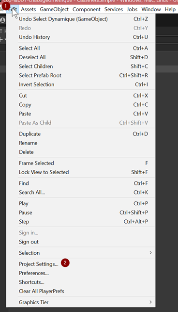
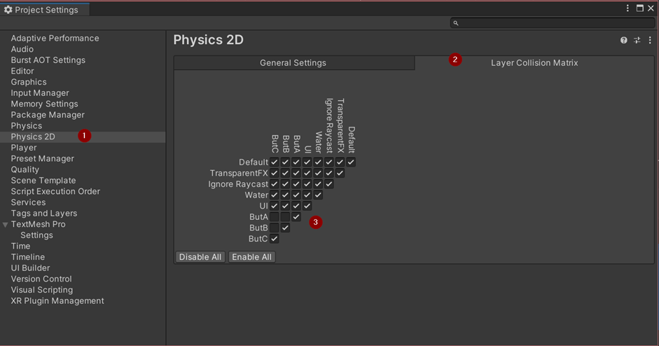

# Unity

## Layers

# Explication des Couches (Layers) dans Unity

Dans votre projet Unity, les "couches" (ou "layers" en anglais) sont utilisées pour catégoriser et organiser les objets du monde du jeu en fonction de leur fonctionnalité ou de leur objectif. Les couches sont essentielles pour de nombreux aspects du développement de jeux, tels que la détection de collisions, l'ordre de rendu et les interactions physiques.

## Qu'est-ce que les Couches ?

Les couches sont des catégories qui permettent de regrouper les objets dans votre scène Unity. Elles déterminent comment ces objets interagissent les uns avec les autres et comment ils se comportent dans le monde du jeu.

## Configuration des Couches

1. Pour configurer les couches dans Unity, accédez au menu supérieur de l'éditeur Unity, puis sélectionnez `Edit -> Project Settings -> Tags and Layers` (Édition -> Paramètres du projet -> Balises et Couches).

2. Dans la fenêtre "Balises et Couches", vous trouverez une section appelée "Couches" où vous pouvez définir jusqu'à 32 couches différentes. Vous pouvez également ajouter vos propres couches personnalisées si nécessaire.

## Utilisations Courantes des Couches

### Détection de Collision

Les couches sont principalement utilisées pour la détection de collisions entre les objets. Vous pouvez spécifier quelles couches d'objets peuvent entrer en collision les unes avec les autres.

### Ordre de Rendu

Les couches déterminent également l'ordre de rendu des objets à l'écran. Cela est crucial pour le rendu en 2D et 3D, car il permet de contrôler l'apparence des objets à l'écran en fonction de leur couche.

### Interactions Physiques

Vous pouvez configurer les interactions physiques en spécifiant quelles couches d'objets interagissent les unes avec les autres. Par exemple, vous pouvez empêcher certaines couches de traverser d'autres objets, ce qui est important pour la simulation de la physique dans le jeu.

En résumé, les couches dans Unity sont un outil puissant pour organiser, contrôler les interactions et gérer le rendu des objets dans votre scène. Elles sont essentielles pour créer des jeux fonctionnels et réalistes.

N'hésitez pas à poser d'autres questions ou à demander des clarifications si nécessaire.

### Pour chaque couleur...
1. Créez une entité vide nommée Solution_X à la racine de la scène.
2. Créez une entité physique en 2D de la forme de votre choix.
   - Assurez-vous qu'elle est enfant de l'entité créée en 1.
3. Ajustez sa couche (layer) en fonction du but. Rappelez-vous de l'emplacement des layers.
4. Coloriez la forme correctement.
5. Placez-la dans la scène pour tenter de résoudre le casse-tête.
   
## Fare en sorte que tout les  couleurs se touchent

Ensuite

